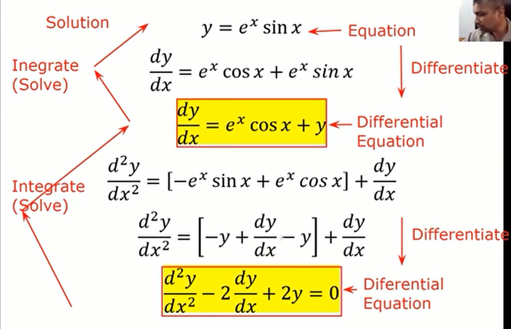
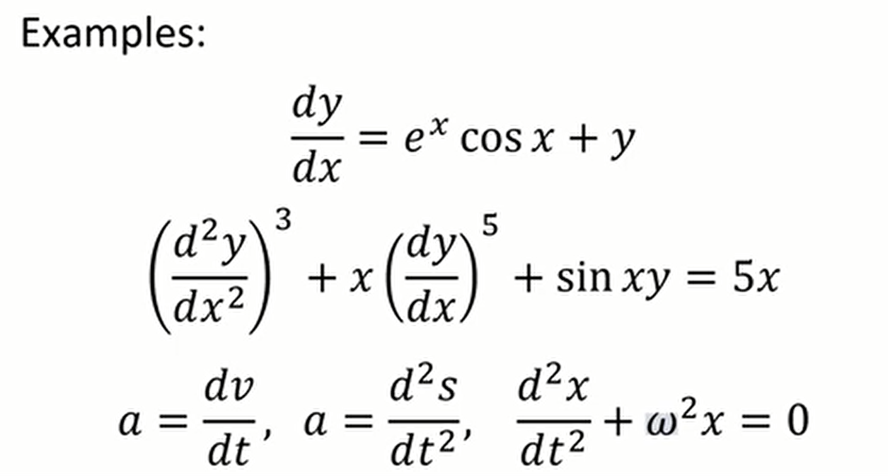

## Differential Equations

In this lesson we will take a look at Single Variable Calculus: Differential Equations.

Differential Equations are just equations you might find in the process of differentiating something. Take a look at the following image. 

### Definition
An equation containing **Differential Coefficients** is known as a Differential Equation.

So, most of the equations we find in Engineering/Physics are differential equations. And that is why need to to obtain the knowledge to solve differential equations.

### Formation of Differential Equations

Differential Equations are obtained by differentiation ordinary equations and eliminating arbitary constants.

Example: 
$$
y = A \sin x + B \cos x  \\
\frac{dy}{dx} = A \cos x - B\sin x \\
\frac{d^2y}{dx^2} = -A\sin x - B\cos x\\
\frac{d^2y}{dx^2} + y = 0
$$

The last equation is a differential equation since it does not contain any arbitary constants.

### Properties of Differential Equations

**Order:** The order of the highest differential coefficient is called the order of the DE.

**Degree:** The degree of the highest differential coefficient after removing the radical signs and fractions of the dependent variable is called the degree of the DE.

Examples:

|Equation|Order|Degree|
|---|---|---|
|$(\frac{d^2y}{dx^2})^3 +x(\frac{dy}{dx})^5 + \sin xy = 5x$|2|3|
|$(\frac{d^2y}{dx^2})^3+(\frac{dy}{dx})^\frac{5}{2} + y = 13$|2|6
|$(\frac{d^2y}{dx^2}+\frac{dy}{dx})^2 + y^\frac{5}{3} = 3$|2|6
|$\frac{d^2y}{dx^2}+\frac{dy}{dx} = \sqrt{\sin x}$|2|1

### Solving Differential Equations

The process of obtaining an equation without containing derivatives from a DE is known as **solving** the DE. The obtained equation is known as the **solution** of the DE.

